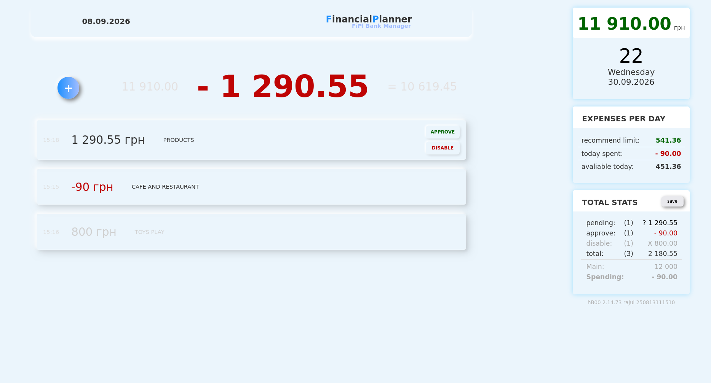
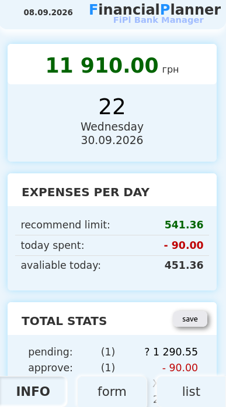
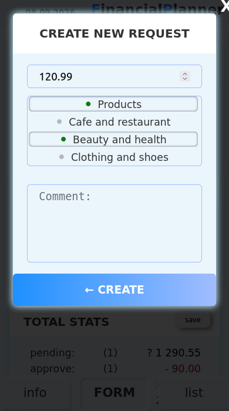
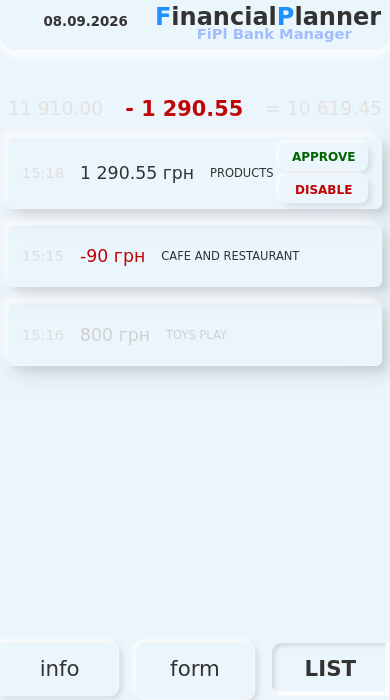

# FIPL — Financial Planner

A standalone personal finance planning application designed to answer a simple question:

> **How much can I safely spend today without breaking my financial plan?**

FIPL was created as a rapid product prototype to experiment with forward-looking personal finance management.

Instead of only tracking past transactions, the application helps define a spending budget for a financial period, plan future expenses, track actual spending, and calculate a recommended daily spending limit.

The product idea, financial model, UI, and original implementation were designed and developed independently from scratch.

## Screenshots

<p align="center">
  
</p>

<p align="center">
  <strong>Financial period planning and daily spending recommendation</strong>
</p>

## The Idea

A bank balance does not necessarily represent the amount of money that is safe to spend.

For example:

```text
Available money               60,000 UAH

Budget until salary           20,000 UAH
Mandatory expenses             8,000 UAH
Groceries                      4,000 UAH
Fuel                           2,000 UAH
Other planned expenses         1,000 UAH
                              ----------
Remaining flexible budget      5,000 UAH
```

FIPL separates the **planning budget** from the actual amount of money available in bank accounts.

Based on the remaining budget and the number of days until the target date, the application calculates how much can safely be spent during the current day.

## Features

### Financial Period

The user can define a financial planning period with a target date.

For example:

```text
Start:        01.09.2026
Target date:  30.09.2026
Budget:       20,000 UAH
```

The application uses this period as the basis for financial calculations.

### Planned Expenses

Future expenses can be added to the plan before they occur.

An expense can contain information such as:

- amount
- category
- subcategory
- description
- date
- quantity
- measurement unit

This allows the planner to work not only with abstract totals but also with concrete expected purchases and expenses.

### Expense States

Planned expenses can have different states:

```text
Pending
Approved
Disabled
```

This allows the application to distinguish between expenses that are still expected, expenses that have already happened, and expenses that should no longer affect the active plan.

### Daily Spending Recommendation

The application calculates a recommended spending amount based on:

```text
Planning budget
       │
       ├── planned expenses
       ├── completed expenses
       │
       ▼
Remaining budget
       │
       ÷
Days remaining
       │
       ▼
Recommended daily spending
```

The result provides a practical answer to:

> How much money can I spend today while staying within the plan?

### Spending Tracking

The application tracks actual spending during the planning period and compares it with the available budget.

This makes it possible to continuously recalculate the financial situation as expenses are completed.

### Categories and Products

Expenses can be organized using categories and subcategories.

The original model also supports quantities and measurement units such as kilograms or liters.

This was designed with more detailed purchase tracking in mind and provides a foundation for future item-level expense analytics.

## Product Approach

FIPL was intentionally developed as a **standalone application** rather than immediately adding the idea to the larger HBOO project.

The goal was to test the financial planning concept quickly and independently.

```text
Product idea
     │
     ▼
Rapid standalone prototype
     │
     ▼
Real working application
     │
     ▼
Practical usage
     │
     ▼
Architecture and product lessons
     │
     ▼
Evolution into HBOO Planning
```

This made it possible to explore the product model without introducing additional complexity into the main financial application.

## Architecture

FIPL is implemented as a lightweight browser application using vanilla JavaScript.

The application handles several responsibilities directly:

```text
Application
│
├── Financial state
├── Planning calculations
├── Rendering
├── Event handling
├── Local persistence
├── Synchronization
└── Reusable UI behavior
```

The original prototype intentionally keeps these parts relatively lightweight so the product concept could be implemented and tested quickly.

Some of these responsibilities were later separated more strictly when the planning concept was integrated into HBOO.

## Event Handling

The interface uses delegated event handling for dynamically rendered elements.

Instead of registering individual event listeners for every planning item, application actions are processed through shared event handling.

This approach made it easier to work with dynamically generated planning lists and controls.

## Local Data

FIPL stores application data locally so that the financial plan can remain available between browser sessions.

The basic flow is:

```text
User action
    │
    ▼
Application state
    │
    ▼
Local persistence
```

The project also contains synchronization functionality for exchanging application state with a server.

The local state allows the application to remain useful independently of continuous server communication.

## Responsive UI

FIPL was designed to work on both desktop and mobile screens.

The interface adapts to the available viewport so that financial planning and expense management can also be used from a phone.

<p align="center">
  
  
  
</p>

## Tech Stack

- JavaScript
- HTML
- CSS
- Browser Local Storage
- WebSocket
- Responsive Web Design

The application does not require React, Vue, Angular, or another frontend framework.

## FIPL and HBOO

FIPL is related to my larger personal finance project, **HBOO — Home Bookkeeping**, but it remains a standalone application.

The projects solve different stages of the personal finance workflow:

```text
HBOO
"What happened with my money?"
        │
        ├── balances
        ├── bank transactions
        └── financial history

FIPL
"What should I do with my money next?"
        │
        ├── budget
        ├── future expenses
        ├── remaining money
        └── safe daily spending
```

The planning concept originally explored in FIPL is now being redesigned and integrated into HBOO using a more structured Store / Service / Repository architecture.

FIPL remains the original standalone prototype and can continue to work independently.

## Future Ideas

The original product model leaves room for features such as:

- automatic matching of planned expenses with bank transactions
- financial goals
- recurring expenses
- historical period comparison
- spending analytics
- product-level purchase history
- receipt scanning
- price and quantity tracking
- spending forecasts
- notifications

Some of these ideas are now more likely to be developed as part of HBOO rather than added directly to the prototype.

## Project Background

FIPL was originally designed and implemented independently from scratch before I started actively using AI coding assistants.

It was not based on a tutorial, predefined specification, or existing financial planning application.

The initial goal was to take a personal finance idea and turn it into a working product prototype quickly enough to evaluate the concept in practice.

The original implementation is intentionally preserved as part of that development history.

## Project Status

**Functional standalone prototype**

The main financial planning concept continues to evolve as part of HBOO, while this repository preserves the original independent FIPL application.